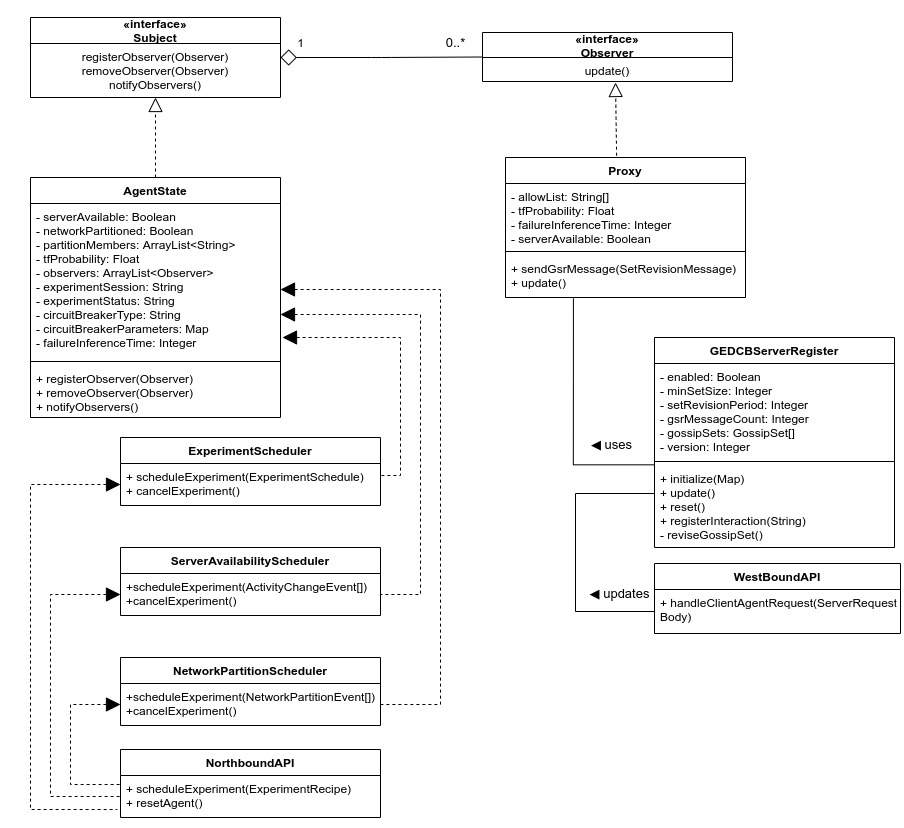

# ProtoCB Server Agent

## About
ProtoCB Test Bed includes a pool of <a href="https://github.com/ProtoCB/client-agent">client agents</a> interacting with a server agent. The interaction is in accordance with a recipe that the <a href="https://github.com/ProtoCB/controller">ProtoCB controller</a> feeds into the agents while scheduling experiments.

The server agent is implemented as a spring-boot web application - the code for which can be found in this repository. The server agent may be launched by running the following command:

```sh
nohup java -jar <path_to_jar> --agent.host=<agent_ip_address> --controller.url=<controller_url> --storage.bucket=<firebase_storage_bucket> --agent.secret=<secret> --server.port=<agent_port> --protocb.home=<protocb_directory> > <path_to_log_file> &
```

## Design

